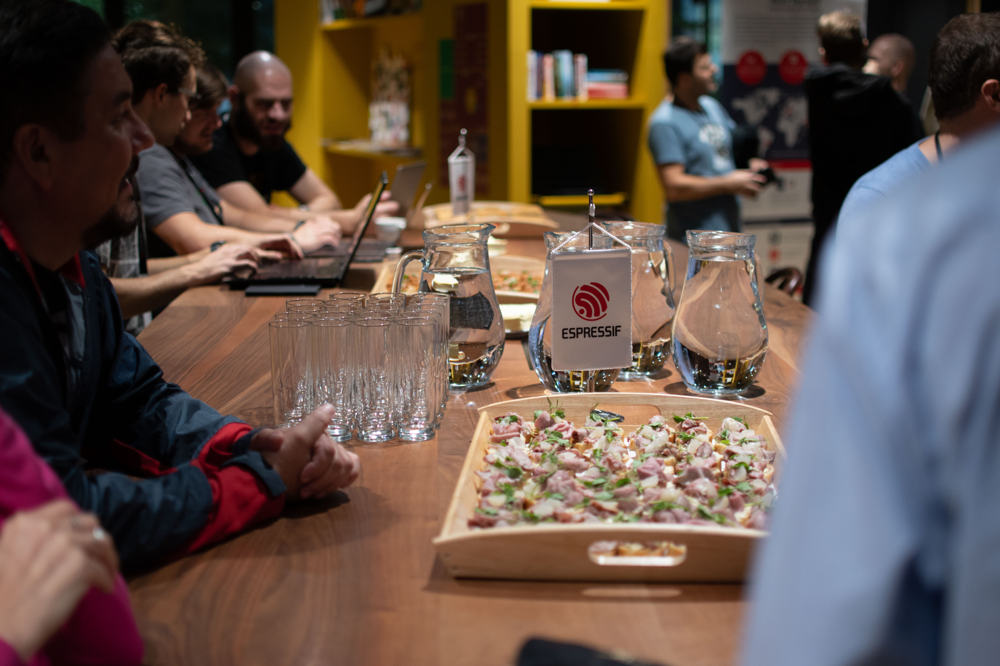
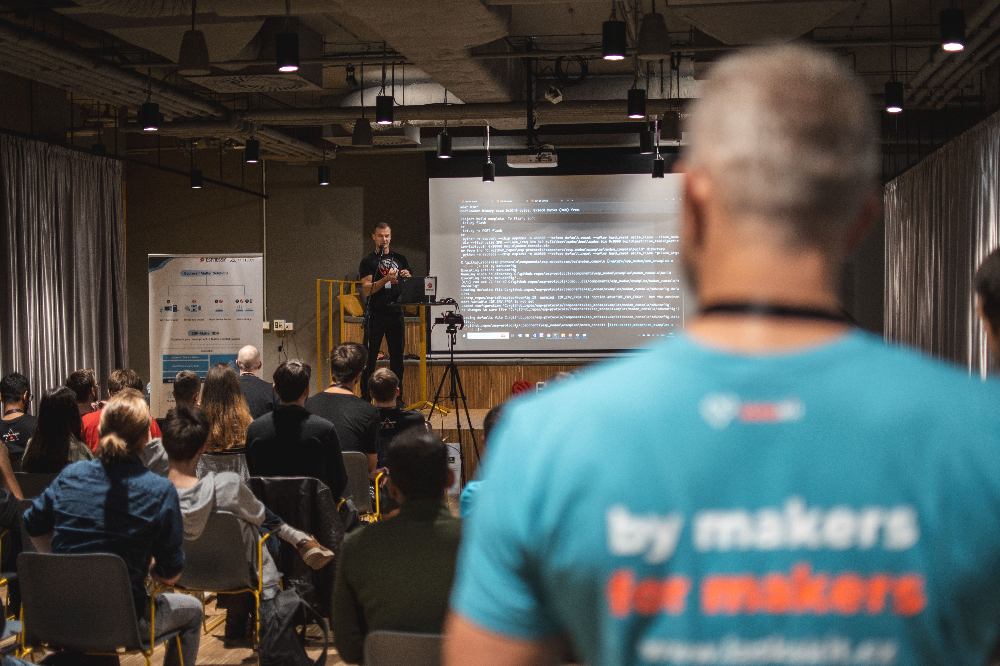
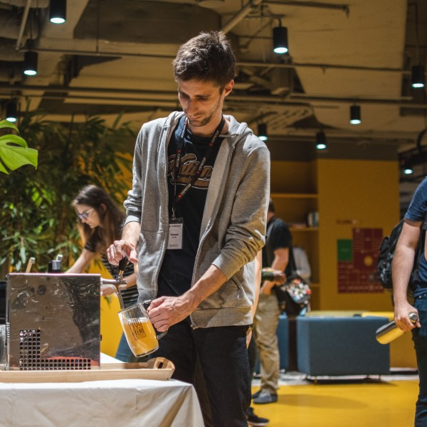
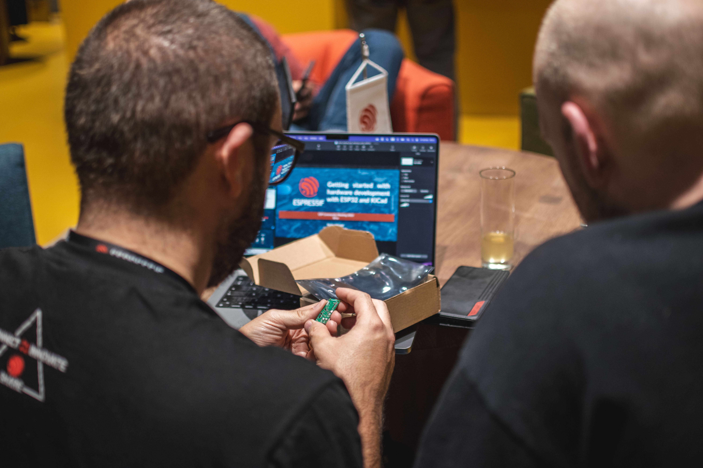
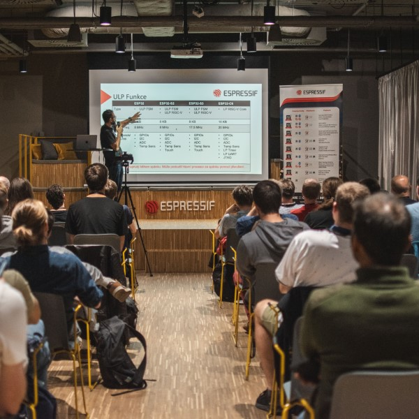
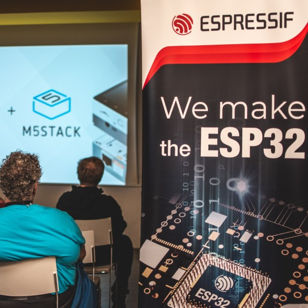
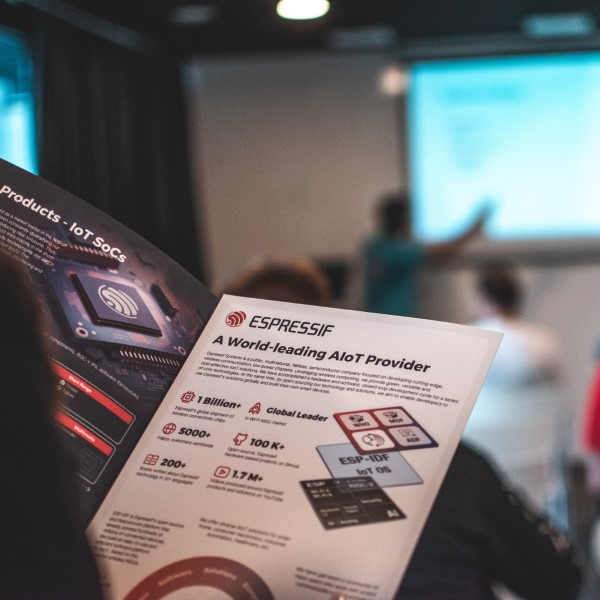
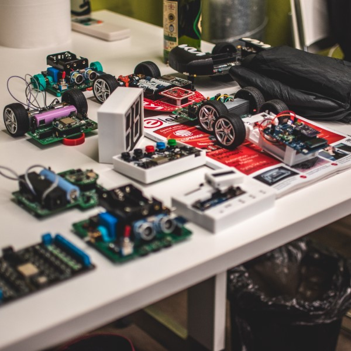


New event!


## Nový Event se blíží

Máme skvělou zprávu! Po úspěšných dvou ročnících tě zveme na naše třetí setkání československého bastlířského eventu, který se letos koná na novém místě – v areálu Vlněna, jen kousek od naší české kanceláře. Jestli tě baví bastlení, programování, zkrátka cokoli kolem našich ESPéček, nebo si prostě zvědavý na naše novinky, tohle si nesmíš nechat ujít!

Těšit se můžeš na zajímavé přednášky, praktické dema, workshop, kde si můžeš vyzkoušet programování v ESP-IDF, a hlavně na skvělou atmosféru mezi lidmi, kteří stejně jako ty milují technologie a objevování nových možností. Přijď si užít večer plný inspirace a setkat se s dalšími nadšenci!

### Na co se tedy můžeš těšit:

<article class="gallery">
  
  
  
  
  
  
  
  
</article>

- **Přednášky** Čekají tě inspirativní přednášky od vývojářů z Espressif, lokálních firem a zapálených nadšenců do ESP! Přijď si poslechnout nejnovější trendy, tipy a triky přímo od lidí, kteří tvoří budoucnost těchto technologií.

- **Workshop** Připravili jsme pro tebe dvouhodinový praktický workshop, kde si budeš moci osahat vývoj na našem novém čipu **ESP32C6**. Budeš mít jedinečnou příležitost ponořit se do vývoje s podporou odborníků! Nezapomeň si vzít **vlastní notebook** a pokud máš, přibal si s sebou kabel USB-A - USB-C.

- **Praktické dema** Sestrojili jsme funkční ukázky nových čipů, které nejsou jen na obdivování, ale můžeš si je rovnou sám vyzkoušet! Přijď objevit co všechno ESP dokážou.

- **Networking** Uvolněná atmosféra u pivka s lidmi, kteří sdílejí stejné nadšení! Poznej nové přátele, popovídej si s tech influencery a dej řeč s našimi vývojáři. Toto je ideální příležitost navázat nové kontakty a sdílet své nápady s komunitou.

### Důležité informace na konec:

- **Kdy:** 18. 10. 2024 v 17:00
- **Kde:** Akce proběhne v areálu Vlněna na adrese **Přízova 3** (vstup je z vnitrobloku Vlněny)

Nepropásni šanci a zaregistruj se co nejdříve ve formuláři níže! Místa jsou omezená a tak si zajisti své místo co nejdříve. **Vstup je zdarma**, ale registruj se prosím jen tehdy, pokud se opravdu chystáš přijít.

<iframe src="https://docs.google.com/forms/d/e/1FAIpQLSeqeP4L90wLu0om38q-wvxKYKI1_Y4Hf4T928NQI8LBW4mHhQ/viewform?embedded=true" width="640" height="1400" frameborder="0" marginheight="0" marginwidth="0">Načítání…</iframe>

Podrobnější informace o akci zveřejníme brzy, takže sleduj naše kanály. Na místě bude samozřejmě zajištěno **občerstvení, pivko i nealko**, takže se můžeš těšit na pohodový večer plný technologií a skvělé atmosféry!

Těšíme se na Vás!

Team Espressif Systems

<iframe src="https://www.google.com/maps/embed?pb=!1m17!1m12!1m3!1d327.9337407635364!2d16.616736464317885!3d49.19003364751185!2m3!1f0!2f0!3f0!3m2!1i1024!2i768!4f13.1!3m2!1m1!2zNDnCsDExJzI0LjMiTiAxNsKwMzcnMDAuMSJF!5e1!3m2!1scs!2ssk!4v1724838797070!5m2!1scs!2ssk" width="600" height="350" style="border:0;" allowfullscreen="" loading="lazy" referrerpolicy="no-referrer-when-downgrade"></iframe>

